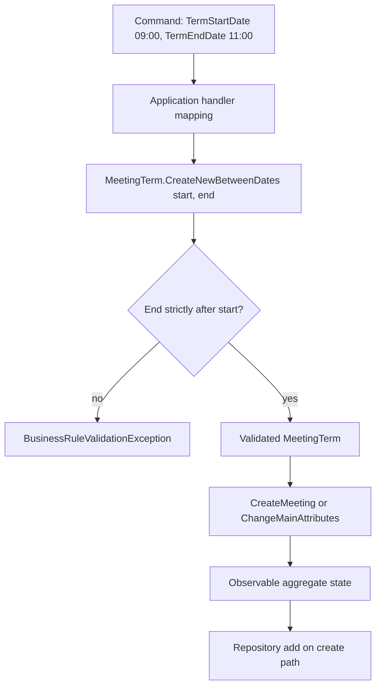

# Follow the requested end through three boundaries

Use an interval from 09:00 to 11:00 UTC on a fixed future date. Write those values next to the command's start and end properties, then beside each factory argument. Avoid a test whose start and end are both computed through separate calls to the real clock: small timing differences make the example harder to reason about without adding useful coverage.

The create handler first loads a meeting group, maps host identifiers, and then asks the group to create the meeting. The term factory runs while the call arguments are evaluated. If that factory rejects the interval, the group creation call cannot receive a completed term argument, and the handler never reaches `AddAsync`. Its test arranges a valid, accepted, nonexpired group so that the interval rule is the relevant failure instead of an unrelated prerequisite.

The change handler loads the existing meeting before constructing the replacement term. A repository read can therefore occur even for an invalid interval. "No persistence write" does not mean "no repository interaction." If term construction rejects, `ChangeMainAttributes` is not entered and the existing aggregate has not received any of the new arguments. This explains why the current invalid-duration regression preserves `_term`. It is an argument-evaluation boundary, not a database rollback mechanism.

Inside [Meeting.ChangeMainAttributes](../../modular-monolith-with-ddd/src/Modules/Meetings/Domain/Meetings/Meeting.cs), the existing attendee-limit rule is checked before assignments. The method then assigns title, term, description, location, limits, RSVP term, fee, and change metadata, and appends a `MeetingMainAttributesChangedDomainEvent`. RSVP handling may clamp its end to the meeting start through `SetRsvpTerm`; do not accidentally substitute the meeting's strict interval policy for the shared RSVP `Term` behavior.

Exercise **MA-02**: build a mapping table with command property, value-object argument, and observed aggregate field for start, end, title, and location. Include both handlers. Exercise **MA-03**: draw the rejected change trace and mark precisely which operations have happened before the exception. Is a repository read forbidden? Has the aggregate mutation method begun? Has a domain event been added? Answer from the actual call placement.

Now compare two defects. Passing start twice causes a valid request to be rejected by the repaired invariant. Removing the strict rule can allow an equal interval to exist. A test that only expects "some exception" for every call could miss both the correct successful mapping and the intended exception type. Use asymmetric valid data and assert both stored boundaries. For invalid cases, assert `BusinessRuleValidationException` and the specific broken rule where that is the unit under test. The combination gives a clearer diagnosis than one broad smoke test.

[Advanced index](README.md)
